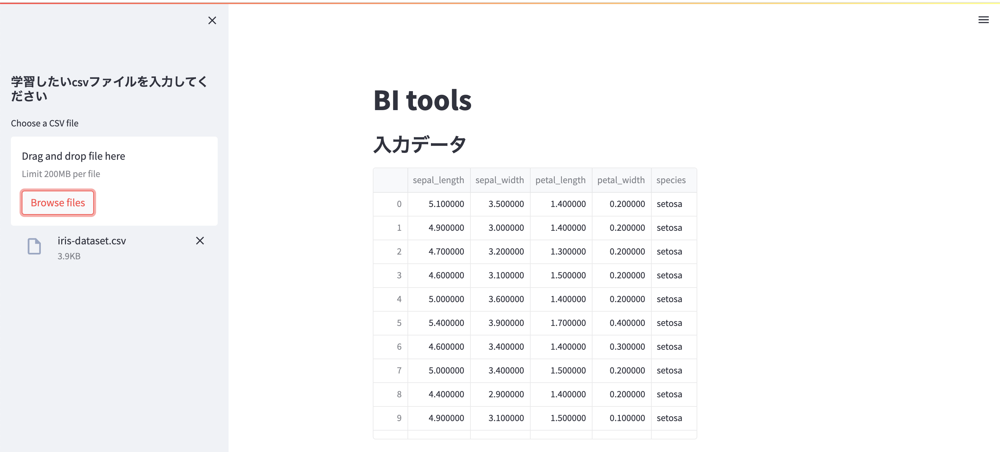
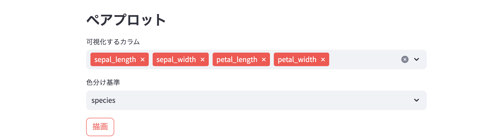
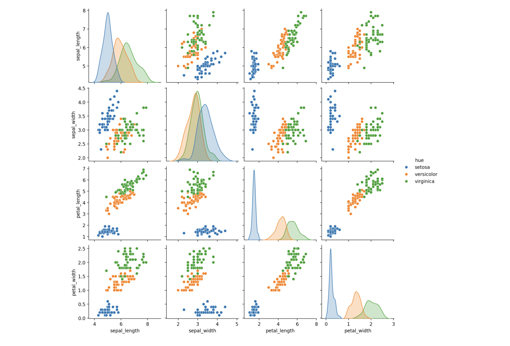
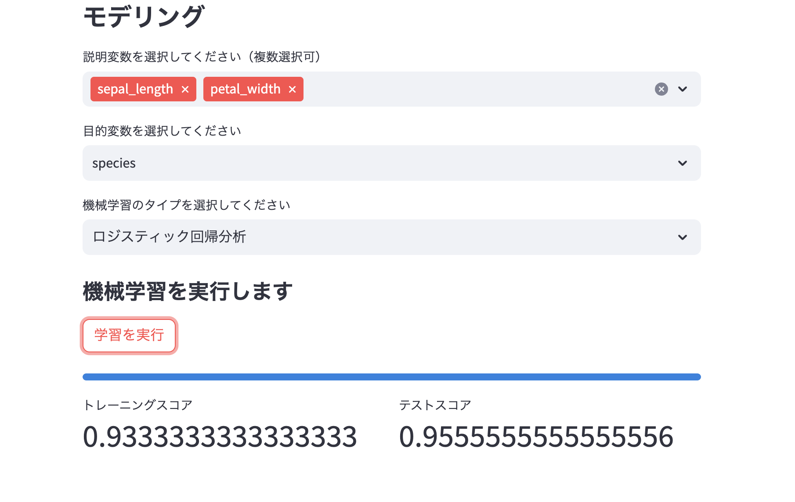

## CSVファイルの挿入
画像のようにサイドバーに分析したいデータが含まれたCSVファイルを挿入します
挿入すると、入力データ等が表示されます

## 単変量の解析
X軸、Y軸に変数を選択するとグラフが生成されます

## ペアプロット
可視化したいcolumnと色分けの基準となるcolumnを選択し「描画ボタン」を押すと、ペアプロットが生成されます

## モデリング
画像のように説明変数、目的変数、学習方法を選択し、「学習を実行ボタン」を押すと学習結果が表示されます

